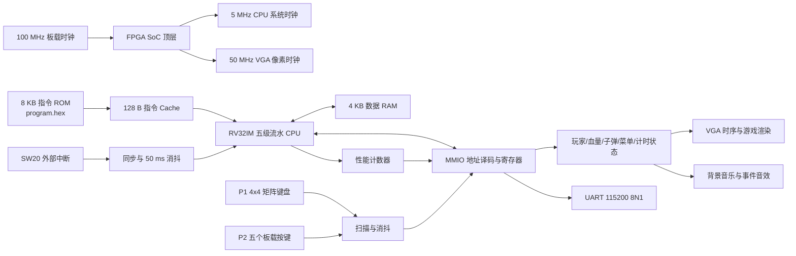

# MiniCPU 项目系统解析与答辩参考

> 文档定位：本文件是课程答辩时的讲解提纲、问题索引和报告草稿。内容以当前最新源码为准，不代替最终实验报告。
>
> 阅读标记：`必须掌握` 表示每位成员都应能独立说明；`重点模块` 表示负责该部分的成员需要结合代码回答；`限制` 表示现场必须如实说明，不能夸大。

## 1. 项目一句话定位

本项目在 Minisys FPGA 上实现了一个以 RV32IM 五级流水 CPU 为核心的小型 SoC。CPU 从指令 ROM 执行游戏程序，通过 MMIO 读取矩阵键盘和板载按键，在软件中计算玩家移动、攻击、碰撞、血量、计时和人机对战状态，再通过 MMIO 将状态交给 VGA 和音频硬件输出。处理器还集成了数据前推、流水线暂停与冲刷、两位动态分支预测、可切换组织方式的指令 Cache、CSR 与简化外部中断、RV32M 乘除扩展、自定义 MAC 指令和性能计数器。

### 1.1 60 秒开场稿

> 我们实现的是一个 RV32IM 五级流水 CPU 及其 FPGA SoC，而不是直接用 Verilog 状态机实现游戏。CPU 采用 IF、ID、EX、MEM、WB 五级流水，通过数据前推处理大部分 RAW 数据相关，通过暂停和冲刷处理人工暂停、CSR 相关、跳转、分支预测失败和异常中断。取指侧加入了 128 字节教学型指令 Cache，可在直接映射与四路组相联之间切换。执行级支持完整的八条 RV32M 乘除指令，并加入自定义乘加指令。CPU 通过 MMIO 读取双人输入、输出游戏状态、访问 UART 和性能计数器。最终游戏逻辑由 CPU 程序执行，VGA 与音频模块负责输出，形成了一个可运行、可测试的小型计算机系统。

## 2. 系统总体架构



### 2.1 硬件与软件的边界

- CPU 软件负责：菜单选择、玩家移动、跳跃、近战、子弹、碰撞、HP/MP、药品、比分、倒计时、软件 AI 和性能报告格式化。
- Verilog 外设负责：按键扫描与消抖、MMIO 寄存器、VGA 像素生成、角色和文字绘制、音乐与音效、UART 发送。
- 关键结论：游戏战斗状态不是由一个独立 HDL 战斗状态机直接计算，而是由 `program.hex` 中的 RISC-V 程序在 CPU 上执行。

证据：`scripts/gen_game_cpu_full.py` 文件头明确说明 CPU 拥有游戏状态，Verilog 只暴露 MMIO 并渲染状态。

## 3. 顶层、时钟与复位

板级顶层模块为 `RV32I46F5SPMMIOSoCTOP`，CPU 系统顶层为 `RV32I46F5SPMMIO`。

| 时钟域 | 当前频率 | 主要模块 |
| --- | ---: | --- |
| 板载输入时钟 | 100 MHz | 顶层分频、键盘扫描、音频 |
| CPU 系统时钟 | 5 MHz | CPU、MMIO、UART、PerfMon |
| VGA 像素时钟 | 50 MHz | 800x600 VGA 扫描与渲染 |

CPU 使用 5 MHz 的主要原因是当前 `MUL/DIV/REM/MAC` 使用 EX 级组合运算，尤其 `/` 和 `%` 会形成较长组合路径。降低频率可以增加 FPGA 上的时序余量。UART 分频参数同步按照 5 MHz 系统时钟配置，外部串口仍使用 115200 8N1。

`限制`：游戏状态从 5 MHz CPU 时钟域送到 50 MHz VGA 时钟域时，没有完整握手或双缓冲 CDC 协议。当前状态变化慢、上板可正常显示，但严格工程设计中应增加快照、双缓冲或跨时钟域同步，避免同一帧内读取到部分新旧状态。

## 4. 五级流水线

### 4.1 五个阶段

| 阶段 | 名称 | 当前项目中的工作 |
| --- | --- | --- |
| IF | Instruction Fetch | PC 选择；经 I-Cache 取指；计算 `PC+4`；对条件分支做预测 |
| ID | Instruction Decode | 解析 opcode/funct3/funct7/rs/rd；生成立即数；读取寄存器和 CSR；生成控制信号 |
| EX | Execute | ALU、地址计算、分支真实判断、跳转目标、RV32M、MAC、前推选择 |
| MEM | Memory | 数据 RAM/MMIO 访问；字节和半字写掩码；Load 符号或零扩展 |
| WB | Write Back | 从 ALU、Load、LUI、CSR 或 `PC+4` 中选择结果写回寄存器堆 |

阶段之间由四组流水寄存器隔开：

```text
IF -> IF/ID -> ID -> ID/EX -> EX -> EX/MEM -> MEM -> MEM/WB -> WB
```

流水寄存器不仅保存指令和数据，还保存 `register_write_enable`、`memory_read`、`memory_write`、写回选择、CSR 写使能、目标寄存器号等控制信息，保证一条指令的数据和控制在各阶段同步前进。

### 4.2 为什么流水线能提高吞吐率

单条指令仍然需要经过五个阶段，但流水线填满后，理论上每周期可以退休一条指令。它提高的是吞吐率，不是把单条指令的五个步骤变成一步。

```text
周期1：I1-IF
周期2：I1-ID  I2-IF
周期3：I1-EX  I2-ID  I3-IF
周期4：I1-MEM I2-EX  I3-ID I4-IF
周期5：I1-WB  I2-MEM I3-EX I4-ID I5-IF
```

### 4.3 一条 ADD 的完整路径

以 `ADD x5,x1,x2` 为例：IF 取出机器码；ID 读取 `x1/x2` 并生成 R 型 ALU 控制；EX 计算加法；MEM 仅传递结果；WB 把结果写入 `x5`。

### 4.4 Stall、Flush 和 Bubble 的区别

- Stall：保持流水寄存器原值，让某些阶段暂时不前进。
- Flush：把错误路径或不应继续执行的指令替换为 NOP。
- Bubble：主动插入一个 NOP，使后续阶段出现空槽，同时避免某条被冻结的指令重复提交。

当前实现中，跳转和分支预测失败会冲刷 IF/ID 与 ID/EX；异常处理中可以进一步冲刷后级；手动暂停会冻结整个流水线；CSR RAW 处理还包含专门的 bubble 机制。

## 5. 数据相关与数据前推

### 5.1 为什么需要前推

```asm
ADD x5, x1, x2
SUB x6, x5, x3
```

第二条指令进入 EX 时，第一条指令可能还在 MEM 或 WB，尚未完成对 `x5` 的常规写回。如果直接使用 ID 阶段读出的旧 `x5`，结果会错误。这属于 RAW，即 Read After Write 相关。

### 5.2 当前前推路径

`HazardUnit` 比较 EX 阶段的源寄存器与 MEM/WB 阶段的目标寄存器，产生 `hazard_mem` 和 `hazard_wb`。`ForwardUnit` 再从正确阶段选择真实结果送回 ALU。

支持的前推包括：

- MEM/WB 到 ALU 输入 A，对应 `rs1`；
- MEM/WB 到 ALU 输入 B，对应 `rs2`；
- MEM/WB 到 MAC 累加输入 C，对应第三源 `rs3`；
- MEM/WB 到 Store 写数据；
- CSR 相关数据通路。

若 MEM 和 WB 都能提供同一寄存器，MEM 更新，优先级高于 WB。前推值不是固定取 ALU 结果，而是根据生产者指令类型选择 ALU、Load、LUI、CSR 或 `PC+4`。

### 5.3 寄存器堆内部旁路

寄存器堆是组合读、时钟沿写。如果当前 WB 正在写的寄存器恰好也是 ID 读取的寄存器，寄存器堆会直接返回 `write_data`，避免同周期读到旧值。

### 5.4 Load-use 的准确表述

不要机械回答“Load-use 一定暂停一周期”。当前数据 RAM 为组合读，MEM 阶段 Load 数据经过 `ByteEnableLogic` 后可以成为 MEM 前推值，因此 RTL 中没有经典同步 BRAM CPU 那种固定的 load-use 单周期停顿逻辑。

`限制`：这依赖组合存储器和较低时钟频率。如果改成同步 Block RAM，Load 数据通常要到更晚才有效，就需要加入明确的 load-use 检测和气泡。

## 6. 分支预测与控制相关

### 6.1 当前预测器结构

当前 `BranchPredictor` 使用一个全局两位饱和计数器：

| 状态 | 含义 | 预测 |
| --- | --- | --- |
| `00` | 强不跳 | Not Taken |
| `01` | 弱不跳 | Not Taken |
| `10` | 弱跳转 | Taken |
| `11` | 强跳转 | Taken |

复位后为 `00`。取到条件分支时，以计数器最高位作为预测结果；预测跳转时目标为 `IF_pc + IF_imm`，预测不跳时继续 `PC+4`。

### 6.2 预测结果如何纠正

分支进入 EX 后，`BranchLogic` 根据 `funct3` 和 ALU 比较结果得到真实 Taken/Not Taken。若真实结果与预测不同：

1. `branch_prediction_miss` 置位；
2. `PCController` 选择真实目标 `branch_target_actual`；
3. `HazardUnit` 冲刷 IF/ID 和 ID/EX；
4. 错误路径指令被替换为 NOP；
5. 两位计数器根据真实结果向 Taken 或 Not Taken 方向更新。

当前分支在 EX 阶段解析，预测失败通常清除前面两级中的错误指令，因此性能计数器将一次预测失败按约两周期惩罚进行报告。

### 6.3 当前预测器的能力边界

`限制`：它不是每个分支 PC 独立一项的 BHT，所有条件分支共享一个两位计数器；也没有 BTB、全局历史寄存器或局部历史。因此它能展示动态预测原理，但不同分支的行为可能相互干扰。

一个重要历史修复是 IF 阶段 B 型立即数符号扩展曾少一位，导致后向分支目标错误、PC 跑飞。修复后使用 20 位符号扩展。该问题适合作为调试日志案例。

## 7. 指令 Cache

### 7.1 组织结构

当前只实现 I-Cache，没有 D-Cache。总容量为 128 B，共 32 个物理槽，每条 Cache line 只保存一个 32 位指令字。

SW18 可以选择两种组织方式：

| SW18 | 组织 | 结构 |
| --- | --- | --- |
| 0 | 直接映射 | 32 组 x 1 路 |
| 1 | 四路组相联 | 8 组 x 4 路 |

两种模式容量相同，目的是比较相联度对冲突缺失和命中率的影响。四路模式优先选择 invalid way；组内全有效时使用三位树形 pseudo-LRU 选择 victim。

### 7.2 Hit 和 Miss 流程

- Hit：tag 和 valid 匹配，直接返回 Cache 中的指令字。
- Miss：当前周期直接使用组合 ROM 返回的指令，不暂停 CPU；同时锁存 slot、tag、data 和 victim，在下一时钟沿完成 Cache 填充。
- 访问、命中和缺失均产生单周期统计脉冲，送入 PerfMon。

### 7.3 为什么当前 Cache miss 不停顿

后端指令 ROM 是 distributed RAM 形式的组合读，当前地址的指令可以同周期输出。因此 miss 时可以绕过 Cache 直接使用 ROM 数据，`ic_stall` 始终为 0。

`限制`：这不是带真实多周期下级存储器的传统 Cache。它能够展示地址映射、tag/valid、冲突、组相联、替换和命中率，但当前 miss penalty 为 0，不能声称 Cache 明显加速了游戏，也不能直接计算相对于“无 Cache 慢存储器”的 speedup。

### 7.4 为什么还值得实现

它的教学价值包括：比较直接映射与四路组相联的冲突行为；统计命中率；验证同步填充和替换策略；为以后接入同步 BRAM 或更慢存储器留下接口。若继续改进，应加入真实 miss 状态机、整行填充、流水线 stall/ready 和 D-Cache。

## 8. CSR、异常和简化外部中断

### 8.1 当前 CSR

已实现或可读取的主要 CSR 包括：`mvendorid`、`marchid`、`mimpid`、`mhartid`、`mstatus`、`misa`、`mtvec`、`mepc`、`mcause`、`mcycle`、`minstret`。其中 `mtvec/mepc/mcause` 可写，`mcycle/minstret` 用于周期和退休指令计数。

`misa = 0x40001100` 表示 MXL 为 32 位，同时声明 I 和 M 扩展，因此处理器可描述为 RV32IM。

### 8.2 外部中断入口

1. SW20 在板级顶层经过同步和 50 ms 消抖；
2. 稳定的 0 到 1 跳变产生一个 `clk_sys` 单周期脉冲；
3. CPU 用 `irq_active` 锁存请求，避免脉冲丢失；
4. TrapController 将当前 PC 保存到 `mepc`；
5. 将 `mcause` 写为 `0x8000000B`，表示 machine external interrupt；
6. 读取 `mtvec` 并将 PC 重定向到中断处理程序；
7. 冲刷不应继续执行的流水线内容。

### 8.3 游戏中的中断处理

游戏启动时将 `mtvec` 设置为自己的 `irq_handler`。ISR 不直接完成长时间 UART 格式化，而是保存必要寄存器、设置 `IRQ_REQUEST`，然后执行 `MRET`。游戏主循环在安全边界检测请求，暂停游戏状态，显示 `PERF REPORT`，读取性能计数器并通过 UART 打印，之后恢复游戏。

这种“中断只投递事件，耗时工作放到主循环”的方式可以减少中断处理对实时游戏状态的破坏。

### 8.4 中断实现限制

`限制`：这是简化的机器外部中断，不是完整 RISC-V privileged architecture 实现。当前 `mstatus` 为常量，没有完整的 `mie/mip` 使能、pending 和优先级管理；TrapController 以 FSM 顺序写 `mepc/mcause`、读取 `mtvec`。答辩时应使用“简化机器外部中断”这一表述。

## 9. RV32M 乘除法扩展

### 9.1 支持的八条指令

| 指令 | 运算结果 |
| --- | --- |
| `MUL` | 乘积低 32 位 |
| `MULH` | 有符号 x 有符号乘积高 32 位 |
| `MULHSU` | 有符号 x 无符号乘积高 32 位 |
| `MULHU` | 无符号 x 无符号乘积高 32 位 |
| `DIV` | 有符号商，向 0 截断 |
| `DIVU` | 无符号商 |
| `REM` | 有符号余数 |
| `REMU` | 无符号余数 |

编码为 `opcode=0x33`、`funct7=0000001`，再由 `funct3=000..111` 选择八种操作。ControlUnit 将其视为写回 ALU 结果的 R 型指令，ALUController 在 EX 阶段细分具体操作。

### 9.2 边界语义

- `DIV/DIVU` 除数为 0：商为 `0xFFFFFFFF`。
- `REM/REMU` 除数为 0：余数为被除数。
- `0x80000000 / 0xFFFFFFFF`：有符号溢出，商为 `0x80000000`，余数为 0。

### 9.3 实现取舍

当前在 ALU 中使用 Verilog `*`、`/`、`%` 组合运算，结果在 EX 阶段一次产生，不增加 RV32M 专用 stall。优点是复用原有 R 型数据通路和前推、写回逻辑，结构简单；缺点是除法组合路径长、资源和时序压力较大，所以板级 CPU 降到 5 MHz。

`限制`：项目中虽然保留 `IntDiv.v`，但当前 RV32M 数据通路没有实例化该模块。不能把当前实现描述为迭代式或多周期除法器。若需要提高频率，应接入多周期乘除单元，并增加 `start/busy/ready` 与流水线 stall 控制。

### 9.4 验证证据

专项程序覆盖八条指令、符号组合、除零和 `INT_MIN/-1`。程序由 CPU 自己比较实际值与预期值，全部通过后通过 MMIO UART 输出 `OK`；失败时输出测试编号、实际值和预期值。

```text
01 MUL     7 × 6 = 42
02 MULH    -2 × 3，高32位 = 0xFFFFFFFF
03 MULHSU  有符号-2 × 无符号3，高32位 = 0xFFFFFFFF
04 MULHU   0xFFFFFFFF × 2，高32位 = 1
05 DIV     -21 ÷ 4 = -5
06 REM     -21 % 4 = -1
07 DIVU    0xFFFFFFFF ÷ 2 = 0x7FFFFFFF
08 REMU    0xFFFFFFFF % 2 = 1
09 DIV/DIVU 除数为0，商 = 0xFFFFFFFF
10 REM/REMU 除数为0，余数 = 被除数
11 INT_MIN ÷ -1，商 = INT_MIN，余数 = 0
```


```text
scripts/gen_m_ext_test.py
sim/tb_m_ext.v
mem/m_ext_test.hex
scripts/run_m_ext_test.bat
scripts/vivado_run_m_ext_sim.tcl
```

当前最新源码回归结果：`M_EXT_RESULT: PASS (OK)`。

## 10. 自定义 MAC 乘加单元

### 10.1 指令语义

自定义 MAC 的语义为：

```text
rd = rd + rs1 * rs2
```

它将一次乘法和一次累加融合为一条指令，适合点积、卷积和矩阵乘法。

### 10.2 自定义编码

当前使用 `opcode=0x0F`、`funct7=0000001`、`funct3=000`。标准指令字段中的 `rd` 同时作为累加器输入和结果输出：

```text
src_A = R[rs1]
src_B = R[rs2]
src_C = R[rd]
R[rd] = src_C + src_A * src_B
```

InstructionDecoder 在识别该编码时令 `rs3=rd`。寄存器堆增加第三读端口；ID/EX 流水寄存器增加 `read_data3/rs3`；HazardUnit 与 ForwardUnit 增加第三路相关检测和前推；ALU 增加 `src_C` 和 MAC 运算。

### 10.3 为什么第三路前推不可少

```asm
ADD x12, x1, x2
MAC x12, x6, x7
```

MAC 既要写 `x12`，又要把旧 `x12` 当累加器。如果上一条指令刚更新 `x12`，只对 `rs1/rs2` 前推仍会读到旧累加值。因此必须把 `rd` 当作第三源寄存器参与 MEM/WB 前推。

### 10.4 验证证据

矩阵测试计算：

```text
A = [[2,3],[4,5]]
B = [[6,7],[8,9]]
C = A x B = [[36,41],[64,73]]
十六进制输出：MM 24 29 40 49
```

相关文件：`scripts/gen_matrix_mac.py`、`sim/tb_matrix_mac.v`、`mem/matrix_mac.hex`。当前最新源码回归结果为 `RESULT: PASS (MAC matrix)`。

### 10.5 MAC 限制

`限制`：该指令不是 RISC-V 标准扩展，并占用了 `0x0F` 的 FENCE opcode 空间，可能与标准 FENCE/FENCE.I 语义冲突。当前 ALU 只保留乘积低 32 位并做 32 位环绕累加，没有饱和、溢出标志或 64 位累加器。最终游戏程序没有实际执行 MAC，因此应以矩阵专项测试展示，不要声称游戏依赖 MAC。

## 11. 数据存储器、MMIO 与游戏数据流

### 11.1 主要地址空间

| 地址 | 作用 |
| --- | --- |
| `0x00000000` 区域 | 8 KB 指令 ROM，也允许数据侧读取 |
| `0x10000000` 区域 | 4 KB 数据 RAM |
| `0x10010000` | UART TX 数据 |
| `0x10010004` | UART busy 状态 |
| `0x10010008` | 清零/重启 PerfMon 统计窗口 |
| `0x10010020..0x10010050` | 性能计数器 |
| `0x10010100` | P1 位置，低 11 位 X，高字段保存 Y |
| `0x10010104` | P2 位置 |
| `0x10010108` | HP/MP 状态 |
| `0x1001010C` | 攻击、方向、菜单、胜负等 flags |
| `0x10010110` | 双人按键输入，只读 |
| `0x10010114/118` | 两个投射物位置 |
| `0x1001011C` | 药品位置 |
| `0x10010120` | 游戏倒计时 |

MMIO 的本质是 CPU 仍执行普通 `lw/sw`，但地址译码后访问的是外设寄存器而不是普通 RAM。

### 11.2 一次按键到画面变化

```text
P1 按下矩阵键盘“向右”
-> 键盘扫描模块得到按键位
-> MMIO 在 0x10010110 提供输入
-> CPU 执行 lw 读取输入
-> 游戏程序修改 P1 X 坐标
-> CPU 执行 sw 写 0x10010100
-> MMIO 锁存 game_p1_x/game_p1_y
-> VGA 渲染器读取坐标
-> 扫描到对应像素时输出角色颜色
-> 显示器下一帧看到角色移动
```

这条链路可以证明 CPU 不是摆设：输入先被 CPU 程序读取和计算，最终状态才交给显示硬件。

## 12. VGA、音频、UART 与板级控制

- VGA：50 MHz 像素时钟，800x600 时序，游戏区域约 800x480；SW23 在彩条测试与游戏画面之间切换。
- P1：4x4 矩阵键盘，主要使用 4/6/2/5/8 对应左右、跳跃、近战和投射物。
- P2：五个板载按键；SW22 用于将按键解释为游戏输入，避免与调试按键功能冲突。
- 音频：菜单、战斗、死亡、超时曲目以及受击、回血等事件音效；SW21 为总静音。
- UART：程序可向 `0x10010000` 写低 8 位发送字符，并轮询 `0x10010004` 的 busy 位；MMIO 程序输出优先于调试 UART。
- 运行控制：SW0 控制运行；SW8=0 为连续运行，SW8=1 配合 SW9 用于单步；SW18 切换 Cache 组织；切换 Cache 模式后建议复位。

## 13. 性能计数器

PerfMon 统计：周期数、退休指令数、I-Cache access/hit/miss、流水线 stall、分支数、预测失败数、Load/Store 数、RV32M 数、MAC 数以及乘除/MAC EX 占用周期。

游戏在比赛开始时清零统计，菜单和初始化不计入比赛窗口；触发 SW20 后，游戏读取并打印 CPI、MIPS、命中率、分支预测失败率等指标。`game_flags[30]` 显示报告时会 hold 计数器，避免打印过程污染之前的测量结果。

当前集成中断回归示例：

```text
CYC=40447
INST=40284
CPI=1.00
STALL=6
BR=20019
BPM=5
ICACC=40440
ICHIT=40008
ICMISS=432
ICHR=98.93
IC_MISS_PENALTY=0
[D-CACHE NOT IMPLEMENTED]
```

这些数字是某次仿真的样例，不应当作所有运行都固定不变的理论值。

## 14. 当前验证证据

以下结果由 2026-07-13 对最新源码进行临时目录回归得到，不修改项目原文件：

| 测试 | 当前结果 | 证明范围 |
| --- | --- | --- |
| RV32M 专项 | `M_EXT_RESULT: PASS (OK)` | 八条 M 指令及关键边界 |
| MAC 矩阵专项 | `MM 24 29 40 49`，`RESULT: PASS (MAC matrix)` | 第三源、前推、乘加、RAM、UART |
| 外部中断专项 | `EXTERNAL_IRQ_PASS mepc=00000024 mcause=8000000b` | SW 脉冲等价输入、Trap、CSR、返回路径 |
| 游戏中断集成 | `GAME_EXTERNAL_IRQ_PASS ... screen_count=751 p1_hp=100` | 游戏不中断状态破坏、报告显示和 UART 输出 |
| FPGA 上板 | 小组已完成游戏运行验证 | 整机、VGA、输入、音频与 CPU 集成 |

当前目录没有找到可直接引用的最终 Vivado utilization/timing 报告，因此答辩前仍应保存最终综合资源表、WNS/TNS 和 bitstream 版本截图。不要仅以“能上板”替代时序报告。

### 14.1 当前测试入口的一个重要状态

当前 `mem/program.hex` 与 `test_programs/game_cpu_full.hex` 的 SHA-256 完全一致，说明默认 ROM 已经切换为游戏程序。旧版 `tb_selfcheck.v` 仍把 `program.hex` 当作输出 `OK` 的 18 项自检 ROM，因此直接运行旧的默认 selfcheck 可能得到 UNKNOWN，这不等于 CPU 故障，而是 testbench 与默认 ROM 的用途已经不一致。

答辩前应保留两条明确入口：整机/游戏使用 `program.hex`；基础 ISA 回归应显式选择自检 ROM或重新生成对应 ROM。RV32M、MAC、CSR 和中断则继续使用各自独立 ROM，避免一个文件在“游戏镜像”和“自检镜像”之间反复覆盖。

## 15. 推荐现场演示顺序

1. SW23=1 显示 VGA 彩条，证明 VGA 电气和时序通路；再切回 SW23=0。
2. SW22=1、SW8=0、SW0=1，运行游戏，演示菜单、双人输入、移动、攻击、血量和声音。
3. 切换 SW18 前先记录模式，复位后展示直接映射或四路模式；通过性能报告查看命中统计。
4. 触发 SW20，展示 `PERF REPORT` 和 UART 输出，说明中断入口、CSR、`MRET` 与主循环延迟处理。
5. 在 Vivado 或 Icarus 中运行 RV32M 专项，展示 `M_EXT_RESULT: PASS (OK)`。
6. 运行 MAC 矩阵专项，展示 `MM 24 29 40 49` 和 PASS。
7. 有时间再展示一条 MUL/MAC 波形，不要在现场临时添加大量信号。

## 16. 高频答辩问题与参考回答

### Q1：你们做的是 CPU 还是直接用 Verilog 做游戏？

核心是 CPU SoC。游戏状态由 CPU 执行 RISC-V 程序计算，Verilog 负责输入、MMIO、VGA 和音频。证据是输入经 `lw` 读取、状态经 `sw` 写入 MMIO，且移除或更换 `program.hex` 后游戏逻辑不会继续运行。

### Q2：为什么要使用五级流水？

它将取指、译码、执行、访存、写回分开，使多条指令重叠执行，提升吞吐率；代价是产生数据相关和控制相关，因此需要前推、暂停和冲刷。

### Q3：前推和暂停有什么区别？

前推是在结果尚未写回时直接从 MEM/WB 送到 EX，避免无必要等待；暂停是数据或控制暂时无法继续时冻结流水线。能前推解决就不暂停，无法安全取得结果时才需要等待或插气泡。

### Q4：你们为什么没有固定的 load-use stall？

当前 RAM 为组合读，MEM 阶段 Load 值可以直接前推到下一条指令的 EX。若以后改用同步 BRAM，就必须重新加入经典 load-use 检测和停顿。

### Q5：分支在哪里判断？预测失败怎么办？

IF 阶段预测，EX 阶段得到真实结果。预测失败时 PC 改为真实目标，并冲刷 IF/ID 与 ID/EX 中的错误路径指令。

### Q6：两位预测器为什么比一位稳定？

两位状态机需要连续两次相反结果才从强跳转变成预测不跳或反之，单次偶然结果不会立即翻转预测，适合循环末尾只出现一次 Not Taken 的情况。

### Q7：你们的预测器有什么不足？

所有分支共享一个全局两位计数器，没有按 PC 索引的 BHT 和 BTB，不同分支可能互相干扰。它是教学型动态预测器。

### Q8：直接映射和四路组相联有什么区别？

直接映射每个内存块只有一个候选槽，硬件简单但冲突多；四路组相联在同一组内有四个候选 way，可以降低冲突缺失，但比较器和替换逻辑更复杂。

### Q9：为什么 Cache miss 不停顿？

当前后端 ROM 是组合读，miss 时同周期可以取得 ROM 指令，所以直接旁路并在下一周期填充。它能展示 Cache 组织和命中率，但 miss penalty 为 0。

### Q10：Cache 是否让游戏更快？

当前不能这样声称。因为没有慢速下级存储器，hit 和 miss 都能同周期获得指令。它主要用于 Cache 原理和组织方式实验。

### Q11：是否实现 D-Cache？

没有。当前只有 I-Cache，数据侧是 4 KB 组合读 RAM 和 MMIO。

### Q12：RV32M 如何译码？

使用 R 型 `opcode=0x33`，`funct7=1` 表示 M 扩展，再由 `funct3` 区分 MUL、MULH、MULHSU、MULHU、DIV、DIVU、REM、REMU。

### Q13：除零怎么办？

按照 RISC-V 语义，DIV/DIVU 返回全 1，REM/REMU 返回被除数，不产生普通算术异常。

### Q14：乘除法为什么不增加 stall？

当前在 EX 中使用组合运算，一周期产生结果，复用普通 ALU 写回通路。代价是长组合路径和低系统频率，不是高频实现。

### Q15：`misa=0x40001100` 表示什么？

最高的 MXL 字段声明 32 位，扩展位中的 I 和 M 为 1，因此声明 RV32IM。

### Q16：MAC 为什么需要第三个寄存器读口？

语义为 `rd=rd+rs1*rs2`，旧 `rd` 也是输入，因此除了 rs1、rs2，还要读取累加器 rd，并为它增加第三路相关检测和前推。

### Q17：MAC 是标准 RISC-V 指令吗？

不是，是课程项目自定义指令。当前借用 `0x0F` opcode 空间，存在与 FENCE 编码冲突，产品级设计应申请 custom opcode 空间并完善工具链。

### Q18：游戏是否使用了 MAC？

最终游戏 ROM 没有执行 MAC。MAC 通过独立的 2x2 矩阵乘法程序验证。不要用游戏运行作为 MAC 的证明。

### Q19：中断发生后硬件做了什么？

锁存请求，保存 PC 到 `mepc`，写 `mcause=0x8000000B`，读取 `mtvec` 并跳转；处理程序最后执行 `MRET`，从 `mepc` 返回。

### Q20：中断是否完全符合特权规范？

不是。它实现了课程需要的机器外部中断主路径，但没有完整 `mie/mip/mstatus` 中断使能和优先级机制，因此称为简化机器外部中断。

### Q21：为什么 ISR 不直接打印全部性能数据？

UART 格式化耗时长，若在 ISR 中完成会长时间打断游戏。ISR 只投递请求，主循环在干净边界打印，可以减少现场状态破坏。

### Q22：怎样证明测试不是 testbench 假造结果？

测试程序在 CPU 上执行真实指令并自行比较结果，再通过 MMIO UART 输出。testbench 只捕获字符并判断 OK/FAIL，因此覆盖了取指、译码、执行、流水传递、写回和 MMIO。

### Q23：为什么 CPU 频率只有 5 MHz？

当前目标优先保证课程项目的功能正确和上板稳定。组合 DIV/REM、Cache/前推和顶层路径增加了时序压力，因此使用 5 MHz 留出余量。提高频率需要多周期除法、同步存储器和更严格的流水划分。

### Q24：系统最大的工程限制是什么？

主要是组合除法限制频率；Cache 无真实 miss penalty；没有 D-Cache；中断特权状态不完整；CPU 到 VGA 的多位状态缺少严格 CDC；自定义 MAC 编码占用标准空间。

### Q25：AI 在项目中扮演什么角色？

应按事实说明 AI 辅助了部分 RTL、测试和文档生成。小组负责需求与接口确定、代码审查、仿真、问题定位、分支整合、Vivado 综合和上板验证。不能声称所有代码均为成员从零手写，也不能把未理解、未测试的生成代码当作独立成果。

## 17. 关键文件索引

| 内容 | 文件 |
| --- | --- |
| FPGA 顶层与时钟、按键、VGA、音频 | `rtl/top/46F5SP_MMIO_SoC_TOP.v` |
| CPU 总数据通路 | `rtl/top/RV32I46F_5SP_MMIO.v` |
| 指令控制 | `rtl/core/Control_Unit.v` |
| ALU 细分译码 | `rtl/core/ALU_Controller.v` |
| 普通 ALU、RV32M、MAC | `rtl/core/ALU.v` |
| 数据相关判断 | `rtl/core/Hazard_Unit.v` |
| 数据前推 | `rtl/core/Forward_Unit.v` |
| 三读口寄存器堆 | `rtl/core/Register_File.v` |
| 分支预测 | `rtl/core/Branch_Predictor.v` |
| 分支真实判断 | `rtl/core/Branch_Logic.v` |
| PC 优先级选择 | `rtl/core/PC_Controller.v` |
| 四组流水寄存器 | `rtl/pipeline/*.v` |
| 指令 Cache | `rtl/memory/Instruction_Cache.v` |
| 指令 ROM / 数据 RAM | `rtl/memory/Instruction_Memory.v`、`Data_Memory.v` |
| CSR / Trap | `rtl/core/CSR_File.v`、`Trap_Controller.v` |
| MMIO 与地址表 | `rtl/mmio/MMIO_Interface.v` |
| 性能计数器 | `rtl/perf/PerfMon.v` |
| VGA 游戏状态适配 | `rtl/game/Game_Static_Renderer.v` |
| CPU 游戏程序生成 | `scripts/gen_game_cpu_full.py` |
| RV32M 专测 | `scripts/gen_m_ext_test.py`、`sim/tb_m_ext.v` |
| MAC 专测 | `scripts/gen_matrix_mac.py`、`sim/tb_matrix_mac.v` |
| 中断专测 | `sim/tb_external_irq.v`、`sim/tb_game_external_irq.v` |

## 18. 个人讲解建议

负责 RV32M 的成员至少应能脱稿说明：八条指令及编码；乘积高低位和符号组合；除零与溢出；EX 级组合实现；为什么 5 MHz；专项测试如何自检；为什么游戏不是全部八条指令的证明。

负责 Cache 的成员至少应能脱稿说明：容量、line 数、地址拆分；直接映射和四路组相联；pseudo-LRU；同步填充；组合 ROM 旁路；为什么 miss penalty 为 0；为什么不能声称 speedup。

负责中断的成员至少应能脱稿说明：SW20 消抖；`irq_active`；`mepc/mcause/mtvec`；Trap FSM；`MRET`；ISR 投递请求；当前特权规范限制。

所有成员共同必须掌握：整体架构；五级流水；按键到 VGA 的完整链路；前推与冲刷；硬件和软件边界；当前验证证据；AI 使用事实。

## 19. 答辩前待补材料

- [ ] 最终 Vivado Synthesis utilization 截图和表格。
- [ ] 最终 Implementation timing summary，至少记录 WNS、TNS 和时钟频率。
- [ ] 最终 bitstream 对应的源码/压缩包时间和哈希，避免演示版本与讲解版本不同。
- [ ] RV32M PASS、MAC PASS、中断 PASS 的终端截图。
- [ ] 游戏运行、SW20 性能报告、UART 输出的照片或视频备份。
- [ ] 每位成员真实分工和贡献比例。
- [ ] 完整调试日志：现象、假设、定位、修改、回归、上板结果。
- [ ] AI 使用声明：用在哪些环节、成员如何审查和验证。
- [ ] 每位成员至少进行一次不看稿模拟追问，重点回答模块限制。
- [ ] 将当前 ZIP 快照迁移回有提交历史的正式 Git 仓库并打版本标签。当前 ZIP 内的 `.git` 显示 `main` 尚无任何 commit，不能提供有效的版本追溯和贡献证据。
- [ ] 清理最终提交包中的 `xsim.dir`、`.portable_import_check`、`xelab.pb` 等生成物。执行删除前必须先由组内确认，源文件和验证结果要另行备份。
